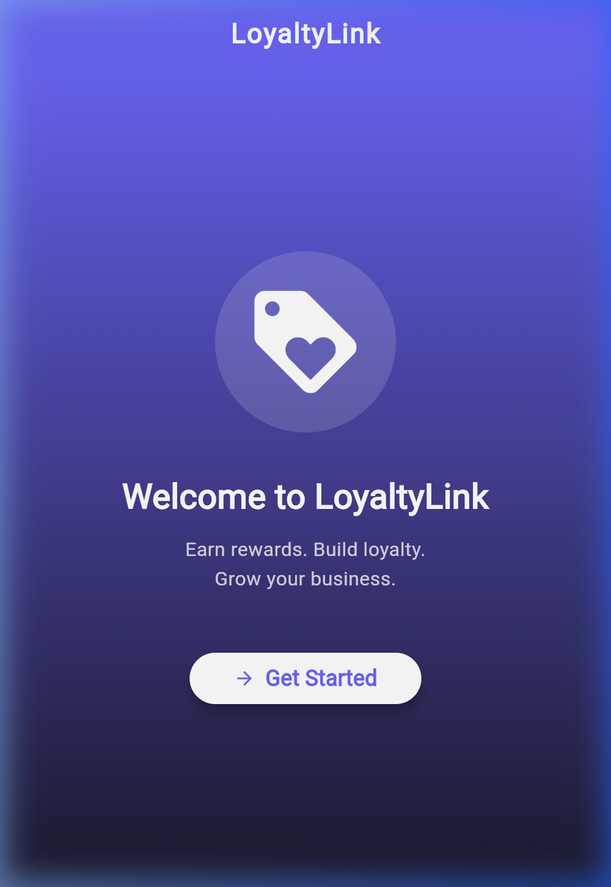
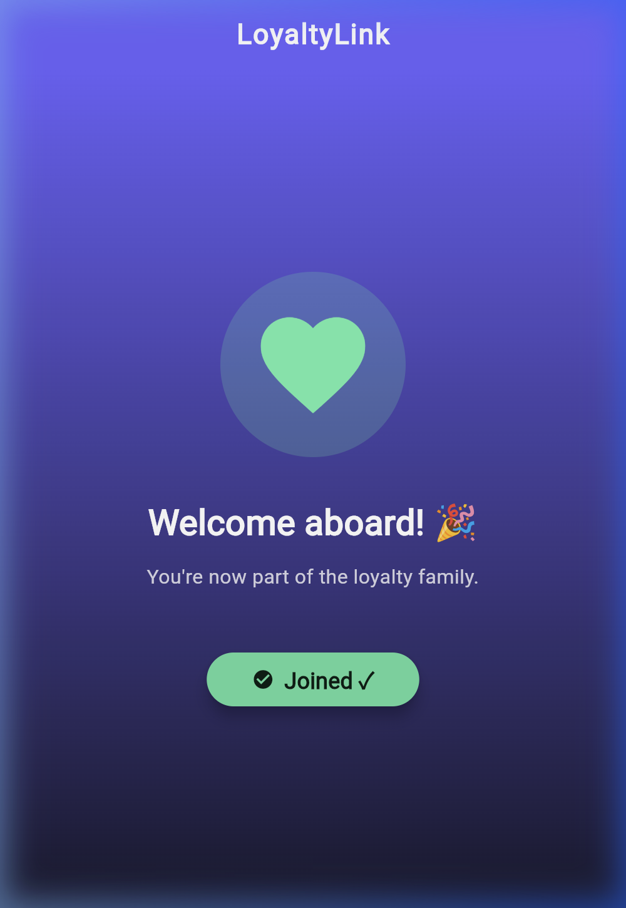

# LoyaltyLink – Digital Loyalty App for Small Businesses

## Sprint #2 Project Plan  
**Technology Stack:** Flutter + Firebase

---

## Project Description

**LoyaltyLink** is a mobile application built with Flutter and Firebase that helps small businesses in Tier-2 and Tier-3 towns manage digital loyalty programs. It replaces traditional paper punch cards with a modern, mobile-first loyalty experience — enabling businesses to track repeat customers, assign loyalty points, and create reward programs.

---

## Demo

### Welcome Screen – Initial State


### Welcome Screen – After Tapping "Get Started"


The Welcome screen features:
- A **gradient background** (purple → dark navy)
- A **loyalty tag icon** that transforms into a **green heart** on interaction
- **Animated text transitions** between "Welcome to LoyaltyLink" and "Welcome aboard! 🎉"
- A **stateful button** that toggles between "Get Started" and "Joined ✓"

---

## Folder Structure

```
loyalty_link/
├── lib/
│   ├── main.dart          # Entry point – initializes MaterialApp & loads WelcomeScreen
│   ├── screens/           # Individual UI screens (one file per screen)
│   │   └── welcome_screen.dart  # Welcome/onboarding screen with stateful interaction
│   ├── widgets/           # Reusable UI components (custom buttons, cards, etc.)
│   ├── models/            # Data structures / classes (User, Customer, Reward)
│   └── services/          # Business logic, Firebase integration, API calls
├── test/
│   └── widget_test.dart   # Widget tests for UI verification
├── android/               # Android-specific configuration and build files
├── ios/                   # iOS-specific configuration (Xcode project)
├── web/                   # Web-specific configuration (index.html, manifest)
├── screenshots/           # App screenshots for documentation
├── pubspec.yaml           # Project dependencies and metadata
└── README.md              # Project documentation
```

### How This Structure Supports Modular App Design

| Directory | Purpose |
|-----------|---------|
| `lib/screens/` | Each screen is a self-contained widget in its own file. This makes navigation and routing straightforward as the app grows. |
| `lib/widgets/` | Shared UI components (e.g., a branded button or loyalty card widget) are extracted here to avoid duplication across screens. |
| `lib/models/` | Dart classes that define data shapes (e.g., `Customer`, `Reward`). Keeping models separate decouples data from UI. |
| `lib/services/` | Firebase Auth, Firestore CRUD, and any API logic lives here. This separation makes it easy to swap or mock backends for testing. |

### Naming Conventions

| Element | Convention | Example |
|---------|-----------|---------|
| **Files** | `snake_case.dart` | `welcome_screen.dart`, `loyalty_card.dart` |
| **Classes** | `PascalCase` | `WelcomeScreen`, `LoyaltyLinkApp` |
| **Widgets** | `PascalCase` (same as classes – widgets are classes) | `WelcomeScreen`, `CustomerCard` |
| **Variables & Functions** | `camelCase` | `_isJoined`, `_toggleJoin()` |
| **Constants** | `camelCase` or `SCREAMING_SNAKE_CASE` | `primaryColor`, `MAX_POINTS` |
| **Directories** | `lowercase` | `screens/`, `widgets/`, `models/` |

---

## Setup Instructions

### Prerequisites
- **Flutter SDK** (3.x or later) — [Install Guide](https://docs.flutter.dev/get-started/install)
- **Android Studio** with Flutter & Dart plugins — OR — **VS Code** with Flutter extension
- An Android emulator, iOS simulator, or Chrome browser

### Steps to Run

```bash
# 1. Verify Flutter installation
flutter doctor

# 2. Clone the repository
git clone <repo-url>
cd Sprint_02_Team_05/loyalty_link

# 3. Install dependencies
flutter pub get

# 4. Run on Chrome (easiest)
flutter run -d chrome

# 5. Or run on Android emulator
flutter run -d emulator-5554

# 6. Or run on a connected physical device
flutter run
```

---

## Reflection

### What I Learned About Dart & Flutter

1. **Widget-based architecture** — Everything in Flutter is a widget. The UI is built by composing small, reusable widgets (`Text`, `Icon`, `Column`, `Scaffold`) into larger ones. This is fundamentally different from imperative UI frameworks.

2. **Stateful vs Stateless** — `StatelessWidget` is for static content; `StatefulWidget` + `setState()` is the mechanism for reactive UI updates. When state changes, Flutter efficiently rebuilds only the affected widgets.

3. **Dart syntax** — Dart is clean and strongly typed. Features like `const` constructors, named parameters, and null safety make code more predictable. The `=>` arrow syntax for one-liners keeps things concise.

4. **Hot reload** — Flutter's hot reload makes the development loop incredibly fast. Changes appear in under a second without losing app state.

5. **Material Design 3** — Flutter ships with `useMaterial3: true` for modern, polished components out of the box. Theming with `colorSchemeSeed` generates a full palette from a single color.

### How This Structure Helps Build Complex UIs

The modular folder structure (`screens/`, `widgets/`, `models/`, `services/`) creates clear separation of concerns:
- **Screens** stay focused on layout and navigation
- **Widgets** can be unit-tested and reused across screens
- **Models** define the data contract independently of UI
- **Services** can be swapped (e.g., mock data → Firebase) without touching UI code

This pattern scales well — adding a new feature (e.g., Customer Profile screen) is just adding a new file in `screens/` and composing existing widgets and services.

---

## Problem Statement

Small businesses in **Tier-2 and Tier-3 towns** struggle to build customer loyalty because they lack simple and affordable tools to track repeat customers or maintain reward programs.

Most of these businesses rely on **manual methods such as paper punch cards or memory**, which leads to:

- Lost loyalty records
- Poor customer tracking
- No insights about repeat customers
- Difficulty managing reward programs

### Key Question

How might we support small businesses with a **modern digital loyalty experience** that is simple, affordable, and easy to manage?

---

## Solution Overview

We propose **LoyaltyLink**, a mobile application built with **Flutter and Firebase** that enables small businesses to manage digital loyalty programs easily.

The app allows businesses to:

- Track repeat customers
- Assign loyalty points
- Create reward programs
- Monitor customer visits

Customers can:

- Earn loyalty points
- Track reward progress
- Redeem rewards directly through the mobile app

This replaces traditional paper loyalty cards with a **mobile-first experience**.

---

## Target Users

### Primary Users
- Small shop owners
- Cafes
- Grocery stores
- Salons
- Local retailers

### Secondary Users
- Customers who frequently visit these businesses

---

## Technology Stack

| Layer | Technology |
|------|------------|
| Frontend | Flutter |
| Programming Language | Dart |
| Backend | Firebase |
| Database | Cloud Firestore |
| Authentication | Firebase Auth |
| Hosting | Firebase Hosting |
| CI/CD | GitHub Actions |

---

## System Architecture

```
Flutter Mobile App
        │
        ▼
Firebase Authentication
        │
        ▼
Cloud Firestore Database
        │
        ▼
Google Cloud Infrastructure
```

Flutter handles the **user interface**, while Firebase provides **authentication, database, and cloud infrastructure**.

---

## App User Flow

```
User opens app
      │
      ▼
Splash Screen
      │
      ▼
Login / Signup
      │
      ▼
Dashboard
      │
 ┌────┴─────┐
 ▼          ▼
Customers   Rewards
 │          │
 ▼          ▼
Add Points  Redeem Rewards
```

---

## MVP Features

### Authentication
- Sign Up
- Login
- Logout

### Customer Management
- Add customer
- View customer list
- Store customer data in Firestore

### Loyalty Points System
- Add loyalty points
- Track customer points balance

### Rewards System
- Create rewards
- Redeem reward points

### Core Screens
- Splash Screen
- Login / Signup Screen
- Dashboard
- Customers Page
- Rewards Page
- Profile Page

---

## Firestore Database Schema

### Users Collection

```
users
   │
   ├── userId
   │     ├── name
   │     ├── email
   │     ├── phone
   │     └── role (business / customer)
```

### Customers Collection

```
customers
   │
   ├── customerId
   │     ├── name
   │     ├── phone
   │     ├── points
   │     └── visitCount
```

### Rewards Collection

```
rewards
   │
   ├── rewardId
   │     ├── rewardName
   │     ├── pointsRequired
   │     └── description
```

---

## Sprint Timeline (4 Weeks)

### Week 1 – Setup & Design
- Finalize app concept
- Create UI wireframes
- Setup Flutter project
- Setup Firebase project
- Configure Firestore database

### Week 2 – Core Development
- Implement login and signup
- Build dashboard UI
- Add customer profile screen
- Implement Firestore read/write operations

### Week 3 – Integration & Testing
- Connect UI with Firestore
- Implement reward redemption
- Add form validation
- Test CRUD operations

### Week 4 – MVP Completion
- UI polish
- Bug fixes
- Application testing
- APK generation
- Documentation and demo preparation

---

## Testing Strategy

### Automated Testing
Flutter widget testing framework.

### Manual Testing
- Login flow
- Customer data entry
- Loyalty points tracking
- Reward redemption

### Device Testing
Testing across multiple Android devices.

---

## Deployment Plan

- Code repository hosted on **GitHub**
- **GitHub Actions** used for CI/CD
- APK build generated for testing
- Optional web deployment using **Firebase Hosting**

---

## Success Metrics

The sprint will be successful if:

- All **MVP features are implemented**
- Firebase **Auth + Firestore integration works**
- Application builds successfully as an **APK**
- Demo works without major bugs
- Mentor review feedback is positive

---

## Risks & Mitigation

| Risk | Impact | Mitigation |
|-----|------|------|
| Firebase configuration issues | Backend delays | Use mock data until Firebase setup works |
| UI bugs | App instability | Modular UI testing |
| Database schema mistakes | Data errors | Plan Firestore structure before development |

---

## Future Improvements

Features planned beyond MVP:

- Push notifications
- QR code scanning for visits
- Business analytics dashboard
- Multi-language support
- Payment integration
- Referral rewards system

---

## Final Vision

LoyaltyLink aims to **empower small businesses with simple digital tools** to build stronger relationships with their customers.

By replacing traditional loyalty cards with a **mobile-first solution powered by Flutter and Firebase**, businesses can increase customer retention while providing a seamless digital experience.