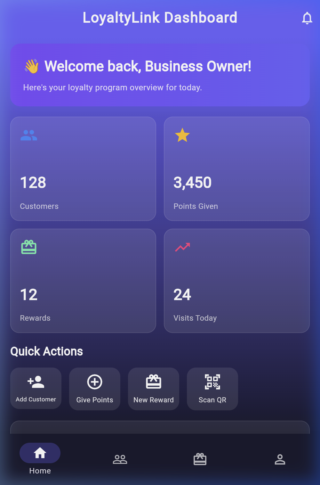
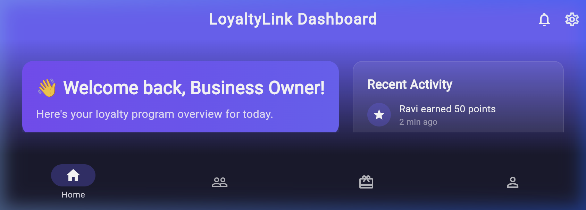
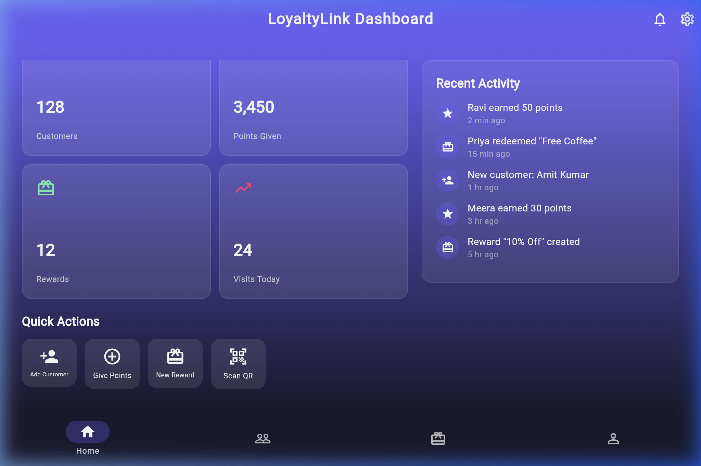

````md
# 📱 Responsive Design with MediaQuery & LayoutBuilder – LoyaltyLink

## 🚀 Sprint #2 – Responsive UI Implementation  
**Technology Stack:** Flutter + Dart

---

## 📌 Project Description

The LoyaltyLink dashboard (`responsive_home.dart`) implements a **fully responsive layout system** using a combination of:

- **MediaQuery** → for device-level responsiveness  
- **LayoutBuilder** → for adaptive layout structures  

This ensures the UI scales seamlessly across:

- Phone (portrait)
- Phone (landscape)
- Tablet devices

---

## 🧠 Core Responsive Strategy

The app uses a **hybrid approach**:

- MediaQuery → controls spacing, sizing, and typography  
- LayoutBuilder → switches layout structure dynamically  

This separation ensures both **visual consistency** and **structural adaptability**.

---

## 📏 MediaQuery – Device-Level Adaptation

```dart
final screenWidth = MediaQuery.of(context).size.width;
final screenHeight = MediaQuery.of(context).size.height;

final isTablet = screenWidth > 600;
final isLandscape = screenWidth > screenHeight;

final horizontalPadding = isTablet ? 24.0 : 16.0;
final titleFontSize = isTablet ? 26.0 : 20.0;
final cardPadding = isTablet ? 20.0 : 14.0;
````

### ✅ Used For:

* Padding adjustments
* Font scaling
* Spacing consistency
* Device classification (tablet vs phone)

---

## 🧱 LayoutBuilder – Structure Switching

```dart
LayoutBuilder(
  builder: (context, constraints) {
    if (constraints.maxWidth > 800) {
      return _buildWideLayout(constraints);
    } else if (constraints.maxWidth > 600) {
      return _buildMediumLayout(constraints);
    } else {
      return _buildNarrowLayout(constraints);
    }
  },
)
```

### ✅ Used For:

* Switching between **Column ↔ Row layouts**
* Controlling grid density
* Showing/hiding panels

---

## 📐 Layout Implementations

### 📱 Narrow Layout (< 600px) — Phone Portrait

```dart
Column(
  children: [
    _buildWelcomeBanner(horizontalPadding, cardPadding),
    GridView.builder(
      shrinkWrap: true,
      physics: NeverScrollableScrollPhysics(),
      crossAxisCount: 2,
    ),
    Wrap(children: actionButtons),
  ],
)
```

---

### 📱 Medium Layout (600–800px) — Phone Landscape

```dart
Column(
  children: [
    _buildWelcomeBanner(...),
    GridView.builder(
      crossAxisCount: 4,
    ),
  ],
)
```

---

### 💻 Wide Layout (> 800px) — Tablet

```dart
Row(
  children: [
    Expanded(
      flex: 3,
      child: Column(
        children: [
          _buildWelcomeBanner(...),
          GridView.builder(crossAxisCount: 2),
        ],
      ),
    ),
    Expanded(
      flex: 2,
      child: _buildActivityPanel(),
    ),
  ],
)
```

---

## 📊 Responsive Breakpoints

| Width     | Device Type     | Layout    | Grid | Side Panel |
| --------- | --------------- | --------- | ---- | ---------- |
| < 600px   | Phone Portrait  | Column    | 2    | ❌ Hidden   |
| 600–800px | Phone Landscape | Column    | 4    | ❌ Hidden   |
| > 800px   | Tablet          | Row (3:2) | 2    | ✅ Visible  |

---

## 🔍 MediaQuery vs LayoutBuilder

| Feature     | MediaQuery      | LayoutBuilder      |
| ----------- | --------------- | ------------------ |
| Scope       | Global screen   | Parent constraints |
| Purpose     | Styling         | Layout switching   |
| Use Case    | Font, padding   | Row vs Column      |
| Flexibility | Fixed to screen | Dynamic to layout  |

---

## 📸 Screenshots

### 📱 Phone Portrait



### 📱 Phone Landscape



### 💻 Tablet View



---

## ✅ Validation Checklist

* ✔ No overflow on small screens
* ✔ Grid adapts correctly across breakpoints
* ✔ Layout switches cleanly (Column ↔ Row)
* ✔ Side panel only visible on large screens
* ✔ Spacing and typography scale properly

---

## 🧠 Reflection

### Why is responsiveness important?

Mobile apps run on thousands of devices with different resolutions and aspect ratios. Without responsiveness:

* UI breaks on small screens
* Large screens waste space
* User experience becomes inconsistent

A responsive design ensures **usability, readability, and visual balance** across all devices.

---

### MediaQuery vs LayoutBuilder (Practical Difference)

* **MediaQuery** → answers *“What device am I on?”*
* **LayoutBuilder** → answers *“How much space do I have right now?”*

This distinction is critical when components are reused inside different layouts.

---

### Scalability Strategy

To scale this system across the app:

* Define global breakpoints (600px, 800px)
* Create reusable `ResponsiveWrapper`
* Standardize spacing and font scaling
* Use LayoutBuilder for all structural decisions

---

## 🎯 Conclusion

The LoyaltyLink dashboard demonstrates a **scalable, maintainable responsive design system** by combining:

* Device-aware styling (MediaQuery)
* Constraint-based layouts (LayoutBuilder)

This approach ensures the UI remains **consistent, adaptive, and production-ready** across all screen sizes.

```


